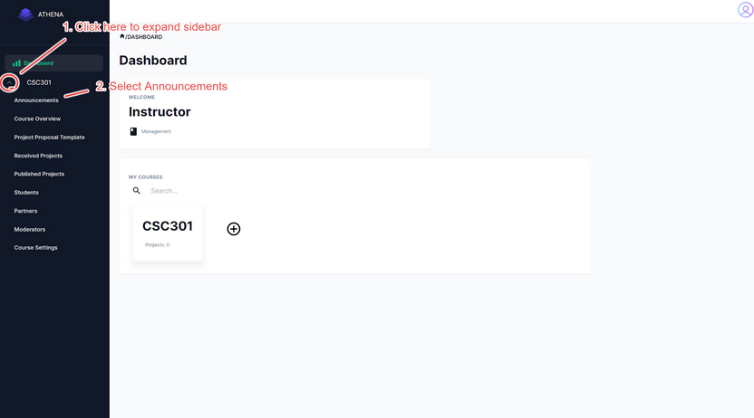
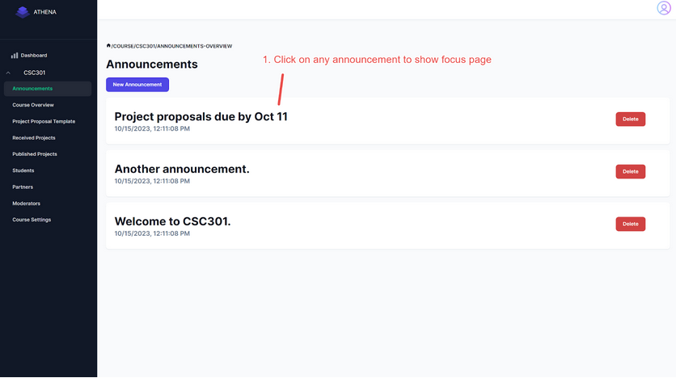
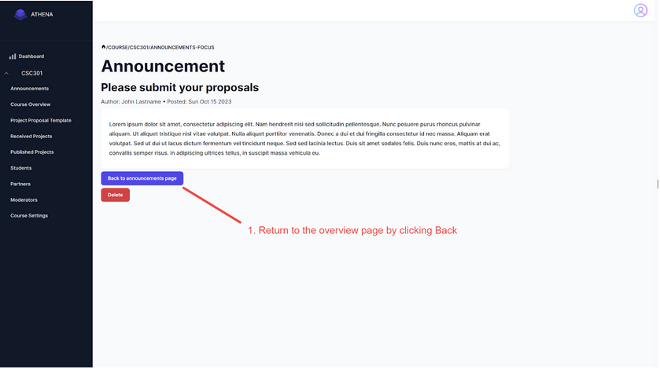
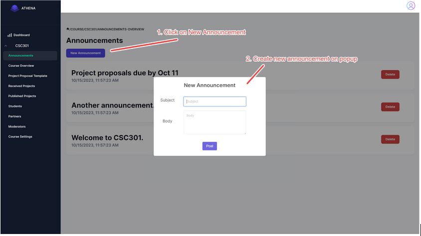
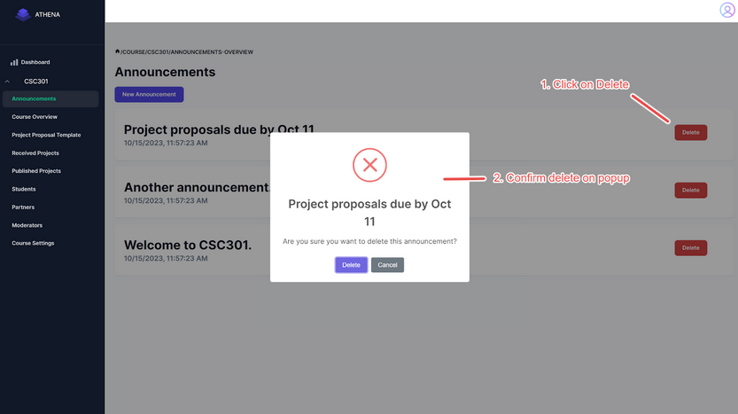

**Athena Learning** is a web application that connects educators, students, and community partners to develop projects for community partners while providing experiential learning opportunities for post-secondary students. **Athena Learning** is a project conceived by [David Jorjani](https://www.linkedin.com/in/jorjani/), in ongoing development by current students at the _University of Toronto_ using **React, Node.js, Next.js, Express, and MongoDB**. Kelly Crawford was a part of the development team for **Athena Learning** in 2023, primarily in front-end, but also trained other team members in all aspects of fullstack development.  

**Athena Learning** allows educators to create course offerings for students and partners to enroll in. Educators can create project proposal templates, use matching algorithms to pair student teams with partners, and perform other administrative tasks.

Students can create skill profiles and form development teams, while community partners can create project proposals for student teams to be assigned to. 

During his time developing **Athena Learning**, Kelly was part of a small team of developers who implemented the front-end for an announcement system that allows educators to send individualized messages to each of their course offerings.

He also participated in the planning and assisted in the development of backend and database architecture for this and other features. 

