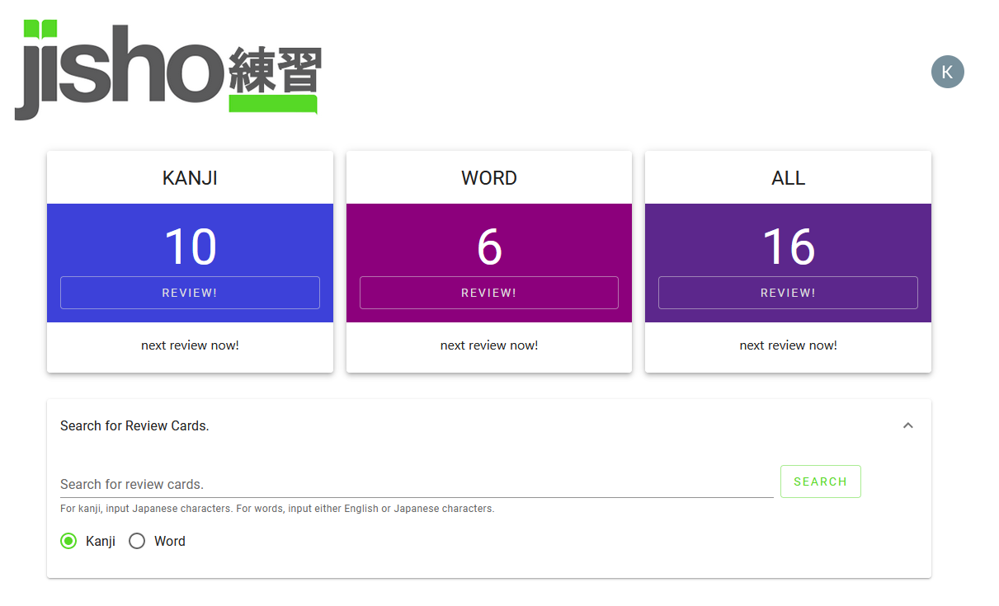
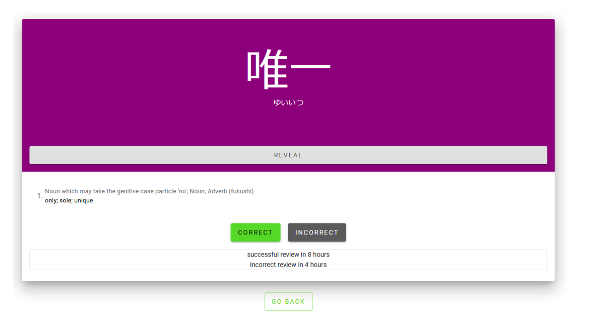
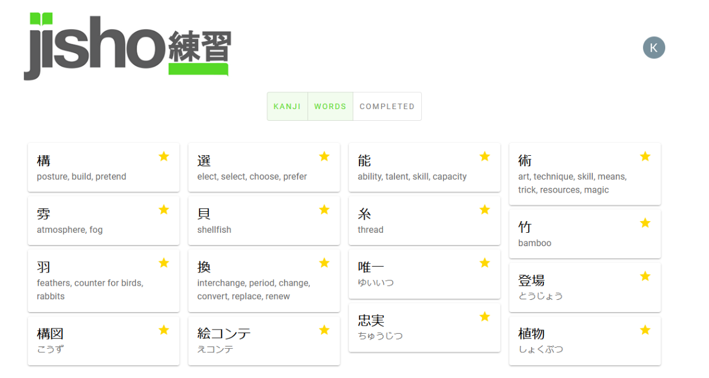

**(Under Construction)** A [spaced-repetition-based](https://en.wikipedia.org/wiki/Spaced_repetition) flashcard application for Japanese vocabulary memorization. **j練習** is an _unofficial_ companion to [jisho.org](www.jisho.org). Utilizing the jisho.org API, **j練習** allows users to create custom vocabulary decks by searching for kanji and vocabulary in the jisho.org dictionary. **j練習** is being developed using **React, Node.js, Express, and MongoDB**. A functioning, but heavily under construction, version of the application is deployed [here](https://jrenshuu.herokuapp.com/). Kelly Crawford is the sole developer of **j練習**.

Upon registration and login, users are served a landing page displaying their upcoming reviews, as well as a search bar that allows them to search for new kanji and vocabulary words to add to their decks.

Cards are served to users with vocabulary details hidden, allowing users to test their knowledge of a given word or kanji before clicking "Reveal" to reveal the card details:

After revealing and reviewing the card, users can indicate whether they were correct or incorrect about the card's meaning. Based on their answers, the cards will be served again to the user at a later date based on [spaced-repetition](https://en.wikipedia.org/wiki/Spaced_repetition) methods to improve long-term memorization.

Users also have the ability to edit their kanji and word decks. 