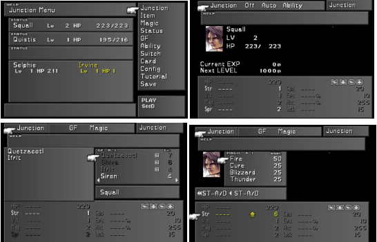

 <video class="self-center" controls>
  <source src="./captures/0.mp4" type="video/mp4">
Your browser does not support the video tag.
</video> 

A 1:1 recreation of menus from _Final Fantasy 8_ made in **Godot** as a proof-of-concept for a data-driven menu system. 

