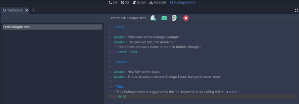

A dialogue editor created as an extension for **Godot** for creating complex, branching dialogue bundles that can fire signals, modify variables, and more. 

Example of back-end editor for dialogue within the **Godot** engine. Titles (indicated by a tilde) are compiled with subsequent lines of dialogue (and function calls/signals, denoted by “do”) into a dictionary that can later be consumed to present dialogue in-game 

Dialogues are saved as individual "dialogue bundles" that must be compiled from the editor before being assigned to in-game nodes for usage. This is handled by a custom parser, with line-by-line error output available.

Example of a dialogue resource, the Godot-equivalent of a Unity scriptable object, and example output in-game.