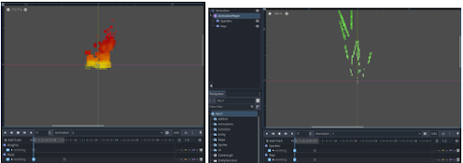

 <video class="self-center" controls>
  <source src="./captures/arpg.mp4" type="video/mp4">
Your browser does not support the video tag.
</video> 

A small prototype built using **Godot** featuring player-programmable AI for ally entities, that can be switched to manual control on-the-fly during gameplay.

In-editor example of AI “gambit” system (inspired by _Final Fantasy XII_) that allows contextual actions to be taken by allies and enemies. All AI is controlled by this system, with plans to make an in-game editor for players to program their allies’ actions for when they are not being controlled by the player. AI "gambits" are built using data-driven in-editor resources similar to Unity's Scriptable Objects.

_Battle examples._ Player allies are AI-controlled (with player-programmable AI algorithms), but can be switched to user-control on-the-fly.

In-editor example of the development of particle effects. 

