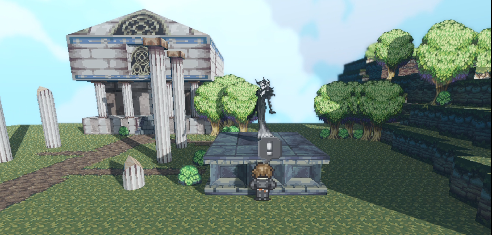
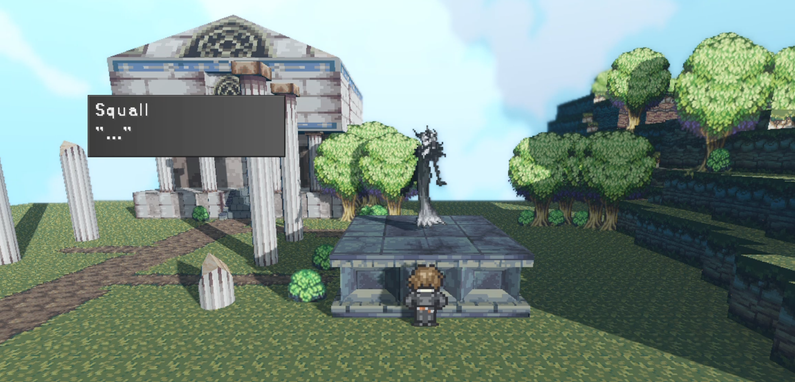
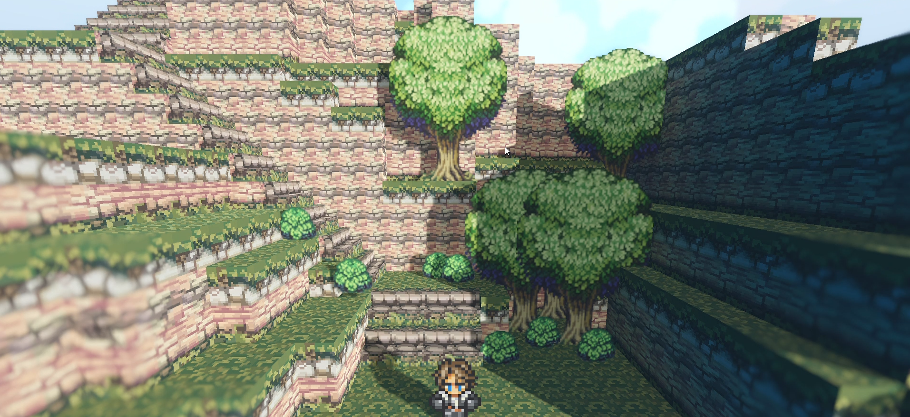

 <video class="self-center" controls>
  <source src="./captures/1.mp4" type="video/mp4">
Your browser does not support the video tag.
</video> 

An HD2D RPG overworld prototype built using **Godot** made using borrowed sprites from _Final Fantasy 8_ and free texture assets. Maps are built using a gridmap system, while in-game world objects were designed using **Blockbench**.

 <video class="self-center" controls>
  <source src="./captures/0.mp4" type="video/mp4">
Your browser does not support the video tag.
</video> 

Interactable objects, and dialogue functionality. 

