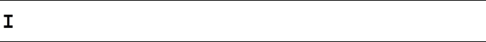

**React Typewriter** is a set of components built for React that can be used to create animated text. It was created with the intention of being used to create text adventures in React, entirely client-side. You can **view a demo ([here](https://k-m-crawford.github.io/react-typewriter-component/)).**

The npm bundle provides various React components such as the text **Typewriter** component and a **StoryPage** that serves multiple typewriter components that can be customized with props and displayed conditionally depending on application state. **StoryPages** can present users with **actionables** that allow them to control the flow of the story; built-in **conditional handling** allows for branching narratives and persistent state variables across StoryPages. 

See **more information on [github](https://github.com/k-m-crawford/react-typewriter-component)**.

See an extensive, gamified demo of the component used to create a text adventure prototype **[here](https://k-m-crawford.github.io/react-text-adventure).** The demo includes examples of support **in-line CSS, dynamic content pulled from things such as Reddit's API, branching narratives, and an internal stat system that can open new branches depending on previous choices.** Note the demo is unfinished, and will eventually stop progressing. 